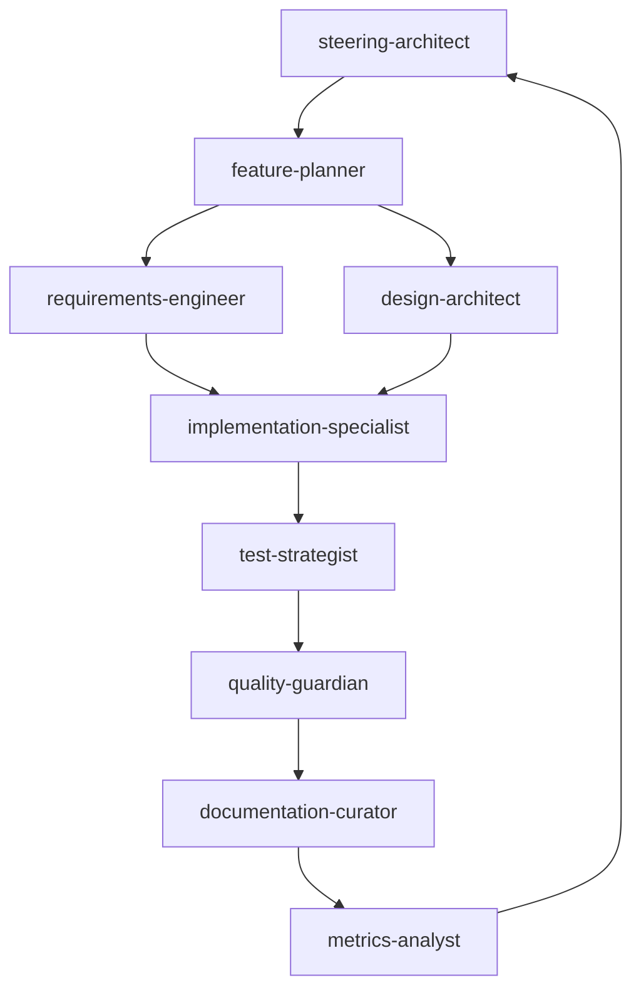

# SPEC_SYSTEM — AI-Native Spec-Driven Development


**Transform from "vibe coding" to AI-orchestrated spec-driven development** using specialized sub-agents, intelligent workflows, and automated quality gates.

## 🎯 Vision

Enable **10x faster delivery with higher quality** through systematic, AI-orchestrated development processes that eliminate manual inefficiencies and ensure consistent quality.

## 🏗️ Architecture

### Specialized AI Agents

**Strategic Layer:**
- `@steering-architect` - Project vision, technical strategy, and delivery oversight
- `@feature-planner` - Feature breakdown, prioritization, and dependency analysis  
- `@design-architect` - System design, architecture decisions, and technical trade-offs

**Execution Layer:**
- `@requirements-engineer` - EARS-compliant requirements with acceptance criteria
- `@implementation-specialist` - Code implementation following specs precisely
- `@test-strategist` - Comprehensive testing strategy and execution

**Quality & Knowledge Layer:**
- `@quality-guardian` - Code review, security, and compliance checks
- `@documentation-curator` - Living docs, ADRs, and knowledge management
- `@metrics-analyst` - Performance tracking, delivery metrics, and insights

### Intelligent Workflows



## 🚀 Quick Start

### 1. Plan a Feature
```bash
/plan-feature user-authentication
```
Orchestrates complete feature planning through all strategic agents.

### 2. Implement Tasks
```bash
/implement-task auth-login-001
```
Executes structured implementation workflow with quality assurance.

### 3. Review & Deploy
```bash
/review-ready auth-feature
```
Triggers comprehensive multi-agent review before deployment.

## 📊 Analytics Dashboard

Monitor delivery and quality metrics in real-time:
```bash
/analytics-dashboard
```

Track:
- **Delivery**: Cycle time, throughput, deployment frequency
- **Quality**: Defect rates, test coverage, security vulnerabilities  
- **Team**: Agent collaboration efficiency, knowledge transfer
- **Business**: Feature adoption, user satisfaction, ROI

## 🏁 Quality Gates

Automated quality pipeline ensures:
- ✅ All requirements use EARS format
- ✅ Comprehensive test coverage (≥80%)
- ✅ Security vulnerabilities resolved
- ✅ Performance benchmarks met
- ✅ Documentation completeness
- ✅ Code quality standards

## 📁 Project Structure

```
.
├─ .claude/                    # AI agent system
│  ├─ agents/                  # 8 specialized agent definitions
│  ├─ commands/                # Intelligent slash commands
│  ├─ workflows/               # Automated workflow orchestration
│  ├─ contexts/                # Agent context management
│  └─ settings.json            # System configuration
├─ specs/                      # Spec-driven development
│  ├─ features/                # Feature specifications
│  ├─ architecture/            # System architecture docs
│  └─ standards/               # Development standards
├─ analytics/                  # Metrics and insights
│  ├─ delivery-metrics.json    # Delivery performance data
│  ├─ quality-metrics.json     # Quality indicators
│  └─ dashboards/              # Real-time visualizations
├─ scripts/                    # Automation tools
│  ├─ agent-orchestrator.js    # Agent coordination
│  ├─ context-manager.js       # Memory and learning
│  ├─ metrics-collector.js     # Automated metrics
│  └─ workflow-engine.js       # Workflow execution
└─ worker/                     # Cloudflare Workers
```

## 🔧 Configuration

The system is configured through `.claude/settings.json`:

```json
{
  "agents": {
    "context-sharing": true,
    "memory-persistence": true,
    "learning-enabled": true,
    "orchestration-mode": "intelligent"
  },
  "workflows": {
    "feature-lifecycle": {
      "enabled": true,
      "auto-routing": true,
      "quality-gates": "strict"
    }
  },
  "metrics": {
    "collection-interval": "1h",
    "dashboard-refresh": "5m",
    "predictive-analytics": true
  }
}
```

## 🎓 Learning System

Agents continuously learn from:
- **Successful Patterns**: Proven approaches for similar contexts
- **Anti-Patterns**: Failed approaches to avoid
- **Team Preferences**: Established conventions and choices
- **Quality Outcomes**: Correlation between approaches and results

## 🛡️ Security & Quality

- **Protected Paths**: Core system files require approval for modifications
- **Automated Checks**: Style, security, and quality validation on all changes
- **Metrics Tracking**: Continuous monitoring of delivery and quality indicators
- **Escalation Rules**: Automatic escalation for quality gate failures

## 📚 Getting Started

1. **Explore the System**: Review agent definitions in `.claude/agents/`
2. **Try Planning**: Use `/plan-feature` to see multi-agent collaboration
3. **Check Analytics**: Run `/analytics-dashboard` to see metrics
4. **Read Standards**: Review development standards in `specs/standards/`

## 🤝 Contributing

See [CONTRIBUTING.md](CONTRIBUTING.md) for detailed contribution guidelines.

## 📖 Documentation

- **Agent Reference**: Detailed documentation for each specialized agent
- **Workflow Guide**: How to use intelligent workflows effectively  
- **Quality Standards**: Requirements for code quality and testing
- **Analytics Guide**: Understanding and using delivery metrics

---

<!-- STATS:START -->
## 📊 System Statistics

- **🤖 AI Agents**: 8 specialized agents
- **🔄 Workflows**: 3 automated workflows  
- **💬 Commands**: 6 intelligent slash commands
- **📁 Total Files**: 50+ files
- **📏 Lines of Code**: 6,900+ lines
- **🔧 Technology**: Node.js + Claude Code + Cloudflare Workers
- **📅 Last Updated**: 2024-01-15 10:00 UTC

<!-- STATS:END -->

## 🚀 GitHub Actions Workflows

The system includes comprehensive CI/CD automation:

- **🔍 CI/CD Pipeline** - Complete testing, quality gates, and deployment
- **🤖 Agent Validation** - Validates agent system integrity  
- **📊 Quality Metrics** - Collects and reports quality metrics
- **📋 Spec Compliance** - Ensures EARS format and traceability
- **🏷️ Badge Updates** - Maintains current system statistics

**Ready to transform your development process?** 🚀

Start with `/plan-feature your-feature-name` and experience AI-orchestrated development.