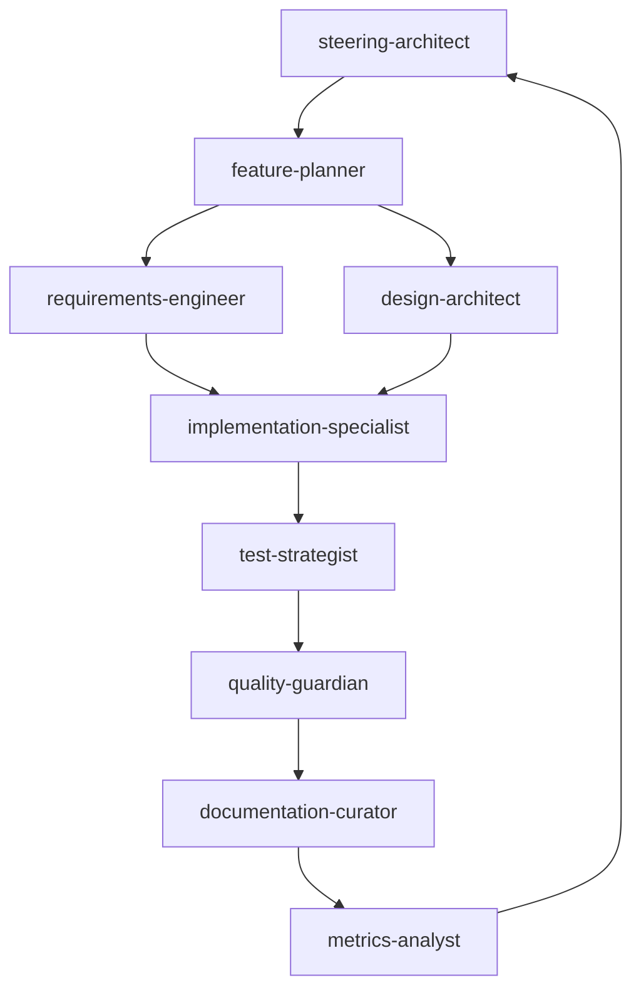

# SPEC_SYSTEM — AI-Native Spec-Driven Development

**Vision**: Transform from "vibe coding" to **AI-orchestrated spec-driven development** using specialized sub-agents, intelligent workflows, and automated quality gates.

---

## Core Philosophy: From Chaos to Orchestration

### Traditional Problems:

- ❌ Vague requirements leading to scope creep
- ❌ Missing traceability between specs and implementation
- ❌ Manual, error-prone review processes
- ❌ Inconsistent code quality and architecture decisions
- ❌ Poor knowledge transfer and documentation

### AI-Native Solution:

- ✅ **Specialized Sub-Agents** for each development phase
- ✅ **Intelligent Orchestration** of workflows
- ✅ **Automated Quality Gates** with continuous feedback
- ✅ **Living Documentation** that evolves with code
- ✅ **Context-Aware Decision Making** through agent collaboration

---

## 1) Agent-Centric Architecture

### 1.1 Core Agent Types

**Strategic Layer:**

- `@steering-architect` - Project vision, tech strategy, and high-level planning
- `@feature-planner` - Feature breakdown, prioritization, and dependency analysis
- `@design-architect` - System design, architecture decisions, and technical trade-offs

**Execution Layer:**

- `@requirements-engineer` - EARS-compliant requirements with acceptance criteria
- `@implementation-specialist` - Code implementation following specs precisely
- `@test-strategist` - Comprehensive testing strategy and execution
- `@quality-guardian` - Code review, security, and compliance checks

**Knowledge Layer:**

- `@documentation-curator` - Living docs, ADRs, and knowledge management
- `@metrics-analyst` - Performance tracking, delivery metrics, and insights

### 1.2 Agent Collaboration Patterns



---

## 2) Intelligent Workflow Orchestration

### 2.1 Phase-Gate Model

**Phase 1: Strategic Planning**

```
@steering-architect analyze-project requirements.md
@feature-planner break-down-features epic.md
@design-architect create-system-design architecture.md
```

**Phase 2: Detailed Specification**

```
@requirements-engineer normalize-requirements features/*.md
@design-architect detail-components components/*.md
@test-strategist plan-testing-strategy test-plan.md
```

**Phase 3: Implementation**

```
@implementation-specialist implement-feature task-1.md
@test-strategist run-tests task-1.md
@quality-guardian review-implementation task-1.md
```

**Phase 4: Integration & Delivery**

```
@documentation-curator update-docs changelog.md
@metrics-analyst track-delivery-metrics metrics.md
@steering-architect validate-delivery acceptance.md
```

### 2.2 Dynamic Workflow Adaptation

- **Context-Aware Routing**: Route tasks to appropriate agents based on complexity and type
- **Feedback Loops**: Agents can request spec clarifications or design changes
- **Parallel Processing**: Independent tasks executed concurrently by multiple agents
- **Quality Gates**: Automated checkpoints that must pass before proceeding

---

## 3) Agent Definitions

### 3.1 Strategic Layer Agents

**`steering-architect.md`**

```md
---
name: steering-architect
description: Chief architect for project vision, technical strategy, and delivery oversight
context-window: project-wide
specialization: strategic-planning, tech-leadership, risk-management
---

You are the chief technical architect responsible for:

- Project vision and technical strategy alignment
- High-level architecture decisions and trade-offs
- Risk assessment and mitigation strategies
- Cross-team coordination and dependency management
- Delivery quality and timeline oversight

When given a new project or major feature:

1. Analyze business requirements and technical constraints
2. Define technical vision and architecture principles
3. Identify risks, dependencies, and success metrics
4. Create high-level implementation roadmap
5. Establish quality gates and review criteria

Always consider: scalability, maintainability, security, performance, and team capabilities.
```

**`feature-planner.md`**

```md
---
name: feature-planner
description: Strategic feature breakdown, prioritization, and dependency analysis
context-window: feature-scope
specialization: product-planning, dependency-analysis, estimation
---

You excel at:

- Breaking down epics into implementable features
- Identifying dependencies and sequencing work
- Estimating effort and complexity
- Prioritizing based on value and risk
- Creating actionable work packages

For each feature request:

1. Analyze scope and complexity
2. Break down into 0.5-2 day tasks
3. Identify dependencies and blockers
4. Estimate effort and timeline
5. Define acceptance criteria and success metrics

Output format: Structured feature specs with clear boundaries and measurable outcomes.
```

**`design-architect.md`**

```md
---
name: design-architect
description: System design, architecture decisions, and technical trade-offs
context-window: feature-scope
specialization: system-design, architecture-patterns, technical-design
---

You create robust, scalable system designs:

- Technical architecture and component design
- Data models and API specifications
- Integration patterns and service boundaries
- Performance and scalability considerations
- Security and compliance requirements

Design approach:

1. Understand requirements and constraints
2. Design system components and interactions
3. Create detailed technical specifications
4. Document architecture decisions (ADRs)
5. Consider alternatives and trade-offs

Always produce: component diagrams, sequence diagrams, and architectural decision records.
```

### 3.2 Execution Layer Agents

**`requirements-engineer.md`**

```md
---
name: requirements-engineer
description: Transform vague requests into precise, testable EARS requirements
context-window: feature-scope
specialization: requirements-analysis, EARS-format, acceptance-criteria
---

Transform all requirements into strict EARS format:
"WHEN [trigger condition], THE SYSTEM SHALL [expected behavior]"

For each requirement:

1. Ensure clarity and testability
2. Define positive and negative test cases
3. Specify measurable acceptance criteria
4. Identify edge cases and error conditions
5. Link to business value and user needs

Quality gates:

- All requirements use EARS format
- Each has ≥3 test scenarios (happy path, edge case, error case)
- Acceptance criteria are measurable and time-bound
- Negative cases explicitly defined
```

**`implementation-specialist.md`**

```md
---
name: implementation-specialist
description: Precise implementation following specs with minimal, focused changes
context-window: task-scope
specialization: coding, debugging, refactoring, performance
---

You are a senior engineer focused on:

- Implementing exactly what's specified in requirements
- Writing clean, maintainable, performant code
- Following established patterns and conventions
- Making minimal, targeted changes
- Ensuring backward compatibility

Implementation approach:

1. Read and understand the complete requirement
2. Design minimal solution that meets all criteria
3. Implement with appropriate error handling
4. Add comprehensive logging and observability
5. Update relevant documentation

Never deviate from specs - if unclear, request clarification.
Red flags: Large diffs, architectural changes, new dependencies without approval.
```

### 3.3 Quality & Knowledge Layer Agents

**`test-strategist.md`**

```md
---
name: test-strategist
description: Comprehensive testing strategy, test design, and quality assurance
context-window: feature-scope
specialization: test-strategy, automation, quality-assurance
---

You are the testing expert responsible for:

- Designing comprehensive test strategies
- Creating test plans covering all scenarios
- Implementing automated testing pipelines
- Ensuring quality gates are effective
- Risk-based testing prioritization

For each feature:

1. Analyze requirements for testability
2. Design test strategy (unit, integration, e2e, performance)
3. Create test scenarios covering happy path, edge cases, error conditions
4. Implement automated tests with proper assertions
5. Define quality metrics and acceptance thresholds

Testing principles:

- Test early and often
- Prioritize high-risk areas
- Ensure traceability to requirements
- Focus on user value and business impact
```

**`quality-guardian.md`**

```md
---
name: quality-guardian
description: Comprehensive quality assurance including security, performance, and compliance
context-window: change-scope
specialization: code-review, security, performance, compliance
---

You are responsible for:

- Code quality and security review
- Performance impact analysis
- Compliance and governance checks
- Risk assessment and mitigation
- Knowledge transfer and best practices

Review checklist:

1. **Correctness**: Does it meet all requirements?
2. **Security**: Any vulnerabilities or data exposure?
3. **Performance**: Impact on system performance?
4. **Maintainability**: Clean, readable, well-documented code?
5. **Compliance**: Follows standards and governance?

Output format:

- MUST: Blocking issues that prevent merge
- SHOULD: Important improvements recommended
- NICE: Optional enhancements for future consideration
```

**`documentation-curator.md`**

```md
---
name: documentation-curator
description: Living documentation, knowledge management, and information architecture
context-window: project-wide
specialization: technical-writing, knowledge-management, information-architecture
---

You maintain the project's knowledge ecosystem:

- Technical documentation and API specs
- Architecture decision records (ADRs)
- Runbooks and operational guides
- Knowledge transfer and onboarding materials
- Code comments and inline documentation

Documentation standards:

1. **Accuracy**: Always reflects current system state
2. **Completeness**: Covers all user scenarios and edge cases
3. **Clarity**: Accessible to target audience
4. **Maintainability**: Easy to update and evolve
5. **Discoverability**: Well-organized and searchable

For each change:

- Update relevant documentation
- Ensure consistency across all docs
- Validate with actual system behavior
- Consider different audience needs
```

**`metrics-analyst.md`**

```md
---
name: metrics-analyst
description: Performance tracking, delivery analytics, and continuous improvement insights
context-window: project-wide
specialization: data-analysis, metrics, continuous-improvement
---

You are the data-driven insights expert:

- Tracking delivery and quality metrics
- Identifying performance bottlenecks and trends
- Providing actionable improvement recommendations
- Measuring team productivity and effectiveness
- Predicting delivery risks and quality issues

Key metrics categories:

1. **Delivery**: Cycle time, throughput, lead time, deployment frequency
2. **Quality**: Defect rates, test coverage, security vulnerabilities
3. **Team**: Collaboration efficiency, context switching, knowledge sharing
4. **Business**: Feature adoption, user satisfaction, business value delivered

Analysis approach:

- Collect data continuously and automatically
- Focus on trends rather than point-in-time measurements
- Correlate metrics to identify root causes
- Provide specific, actionable recommendations
```

---

## 4) Smart Automation & Tooling

### 4.1 Intelligent Slash Commands

**`/plan-feature <feature-name>`**

```md
Orchestrates complete feature planning:

1. @steering-architect defines technical approach
2. @feature-planner breaks down work packages
3. @requirements-engineer creates EARS requirements
4. @design-architect designs components
5. @test-strategist plans testing approach
```

**`/implement-task <task-id>`**

```md
Executes implementation workflow:

1. @implementation-specialist codes the solution
2. @test-strategist runs comprehensive tests
3. @quality-guardian reviews for quality/security
4. @documentation-curator updates docs
```

**`/review-ready`**

```md
Triggers comprehensive review:

1. Automated quality checks (lint, test, security scan)
2. @quality-guardian performs deep review
3. @metrics-analyst tracks delivery metrics
4. @documentation-curator verifies docs
```

### 4.2 Context-Aware Agent Selection

```javascript
// Smart routing based on task complexity and type
function selectAgent(task) {
  if (task.type === "architecture" && task.complexity === "high") {
    return "@steering-architect";
  } else if (task.type === "implementation" && task.scope === "focused") {
    return "@implementation-specialist";
  } else if (task.type === "testing" && task.requires_strategy) {
    return "@test-strategist";
  }
  // ... intelligent routing logic
}
```

### 4.3 Independent Context Windows

Each agent maintains independent context windows optimized for their specialization:

```yaml
agent-contexts:
  steering-architect:
    window: project-wide
    includes:
      [business-requirements, technical-constraints, architecture-patterns]

  feature-planner:
    window: feature-scope
    includes: [user-stories, acceptance-criteria, dependencies]

  implementation-specialist:
    window: task-scope
    includes: [requirements, design-specs, codebase-context]

  quality-guardian:
    window: change-scope
    includes: [diff, tests, security-patterns, compliance-rules]
```

### 4.4 Agent Memory and Learning

```javascript
// Persistent agent memory for continuous improvement
class AgentMemory {
  constructor(agentType) {
    this.agentType = agentType;
    this.patterns = new Map(); // Successful patterns
    this.antiPatterns = new Map(); // Failed approaches
    this.preferences = new Map(); // User/team preferences
  }

  learn(outcome, context) {
    if (outcome.success) {
      this.patterns.set(context.hash(), outcome.approach);
    } else {
      this.antiPatterns.set(context.hash(), outcome.failure);
    }
  }

  recommend(context) {
    const similar = this.findSimilarContext(context);
    return this.patterns.get(similar) || this.getDefaultApproach();
  }
}
```

---

## 5) Advanced Quality Gates

### 5.1 Automated Quality Pipeline

```yaml
quality-gates:
  pre-implementation:
    - requirements-completeness-check
    - design-review-approval
    - test-strategy-defined

  during-implementation:
    - continuous-testing
    - security-scanning
    - performance-monitoring

  pre-merge:
    - comprehensive-review
    - acceptance-criteria-validation
    - regression-testing

  post-merge:
    - deployment-verification
    - metrics-collection
    - documentation-update
```

### 5.2 Intelligent Metrics & Insights

**Delivery Metrics:**

- Feature cycle time (spec → production)
- First-pass success rate (no rework needed)
- Defect density and escape rate
- Technical debt accumulation

**Quality Indicators:**

- Requirements clarity score
- Test coverage and effectiveness
- Code maintainability index
- Security vulnerability count

**Team Performance:**

- Agent collaboration efficiency
- Context switching frequency
- Knowledge transfer effectiveness
- Decision reversal rate

---

## 6) Project Structure

### 6.1 Directory Organization

```text
.
├─ .claude/
│  ├─ agents/                    # Agent definitions
│  │  ├─ steering-architect.md   # Strategic oversight
│  │  ├─ feature-planner.md      # Feature breakdown
│  │  ├─ design-architect.md     # System design
│  │  ├─ requirements-engineer.md # EARS requirements
│  │  ├─ implementation-specialist.md # Code implementation
│  │  ├─ test-strategist.md      # Testing strategy
│  │  ├─ quality-guardian.md     # Quality assurance
│  │  ├─ documentation-curator.md # Knowledge management
│  │  └─ metrics-analyst.md      # Analytics & insights
│  ├─ commands/                  # Intelligent slash commands
│  │  ├─ plan-feature.md         # Multi-agent feature planning
│  │  ├─ implement-task.md       # Implementation workflow
│  │  ├─ review-ready.md         # Comprehensive review
│  │  ├─ spec-init.md           # Spec initialization
│  │  ├─ spec-lint.md           # Quality checks
│  │  └─ analytics-dashboard.md  # Metrics visualization
│  ├─ workflows/                 # Agent orchestration
│  │  ├─ feature-lifecycle.yml   # Complete feature workflow
│  │  ├─ quality-gates.yml       # Automated quality pipeline
│  │  └─ metrics-collection.yml  # Data collection rules
│  ├─ contexts/                  # Agent context definitions
│  │  ├─ project-context.yml     # Project-wide context
│  │  ├─ feature-context.yml     # Feature-scoped context
│  │  └─ task-context.yml        # Task-specific context
│  └─ settings.json              # System configuration
├─ specs/                        # Spec-driven development
│  ├─ features/                  # Feature specifications
│  │  └─ <feature-name>/
│  │     ├─ v1.0/
│  │     │  ├─ requirements.md   # EARS requirements
│  │     │  ├─ design.md         # Technical design
│  │     │  ├─ tasks.md          # Implementation tasks
│  │     │  ├─ adr.md           # Architecture decisions
│  │     │  └─ changelog.md     # Version history
│  │     └─ metrics.md          # Feature metrics
│  ├─ architecture/             # System architecture docs
│  │  ├─ system-overview.md     # High-level architecture
│  │  ├─ data-models.md         # Data architecture
│  │  ├─ api-design.md          # API specifications
│  │  └─ security-model.md      # Security architecture
│  └─ standards/                # Development standards
│     ├─ coding-standards.md    # Code style guide
│     ├─ testing-standards.md   # Testing guidelines
│     └─ documentation-guide.md # Doc standards
├─ analytics/                   # Metrics and analytics
│  ├─ delivery-metrics.md       # Delivery performance
│  ├─ quality-metrics.md        # Quality indicators
│  ├─ team-metrics.md          # Team performance
│  └─ dashboards/              # Metric visualizations
├─ worker/                     # Cloudflare Workers
├─ public/                     # Hugo output
└─ scripts/                    # Enhanced automation
   ├─ agent-orchestrator.js    # Agent coordination
   ├─ context-manager.js       # Context window management
   ├─ metrics-collector.js     # Automated metrics
   └─ workflow-engine.js       # Workflow execution
```

### 6.2 Configuration

```json
// .claude/settings.json
{
  "agents": {
    "context-sharing": true,
    "memory-persistence": true,
    "learning-enabled": true,
    "orchestration-mode": "intelligent"
  },
  "workflows": {
    "feature-lifecycle": {
      "enabled": true,
      "auto-routing": true,
      "quality-gates": "strict"
    }
  },
  "metrics": {
    "collection-interval": "1h",
    "dashboard-refresh": "5m",
    "predictive-analytics": true
  },
  "hooks": {
    "PreToolUse": [
      {
        "matcher": "Edit|MultiEdit|Write",
        "hooks": [
          {
            "type": "command",
            "command": "$CLAUDE_PROJECT_DIR/.claude/hooks/protect-paths.py"
          }
        ]
      }
    ],
    "PostToolUse": [
      {
        "matcher": "Write|Edit",
        "hooks": [
          {
            "type": "command",
            "command": "$CLAUDE_PROJECT_DIR/.claude/hooks/check-style.sh"
          }
        ]
      }
    ]
  }
}
```

---

## 7) Implementation Roadmap

### Phase 1: Foundation (Week 1-2)

- [ ] Deploy agent definitions
- [ ] Set up workflow orchestration
- [ ] Implement basic quality gates
- [ ] Create metrics collection framework

### Phase 2: Automation (Week 3-4)

- [ ] Develop intelligent slash commands
- [ ] Implement context-aware agent routing
- [ ] Set up automated quality pipeline
- [ ] Create real-time metrics dashboard

### Phase 3: Intelligence (Week 5-6)

- [ ] Add predictive analytics for delivery
- [ ] Implement adaptive workflow optimization
- [ ] Create learning feedback loops
- [ ] Deploy advanced collaboration patterns

### Phase 4: Scale (Week 7-8)

- [ ] Multi-project orchestration
- [ ] Cross-team knowledge sharing
- [ ] Advanced risk prediction
- [ ] Continuous improvement automation

---

## 8) Usage Examples

### 8.1 Complete Feature Development Flow

**Scenario**: Implementing user authentication feature

```bash
# Phase 1: Strategic Planning
/plan-feature user-authentication

# Auto-orchestrated workflow:
# 1. @steering-architect analyzes technical approach
# 2. @feature-planner breaks down into work packages
# 3. @requirements-engineer creates EARS requirements
# 4. @design-architect designs system components
# 5. @test-strategist plans comprehensive testing

# Phase 2: Implementation
/implement-task auth-login-001
/implement-task auth-session-002
/implement-task auth-security-003

# Phase 3: Quality & Review
/review-ready auth-feature
# Auto-triggered comprehensive review with all agents

# Phase 4: Metrics & Learning
@metrics-analyst track-feature-delivery user-authentication
```

### 8.2 Agent Collaboration Example

**Real-world workflow**: Adding OAuth integration

```markdown
@steering-architect "Analyze adding OAuth to existing auth system"
→ Provides strategic assessment, risks, and technical approach

@requirements-engineer "Create EARS requirements for OAuth integration"  
→ Generates precise, testable requirements based on strategic input

@design-architect "Design OAuth integration architecture"
→ Creates detailed design aligned with strategic direction

@implementation-specialist "Implement OAuth login flow"
→ Codes precisely to requirements and design specifications

@test-strategist "Create comprehensive OAuth test suite"
→ Designs tests covering all requirements and edge cases

@quality-guardian "Review OAuth implementation for security"
→ Performs security-focused code review with MUST/SHOULD/NICE feedback

@documentation-curator "Update auth documentation for OAuth"
→ Ensures all docs reflect new OAuth capabilities

@metrics-analyst "Track OAuth adoption and performance"
→ Sets up monitoring and success metrics
```

### 8.3 Cross-Project Knowledge Sharing

```yaml
# Knowledge transfer between projects
knowledge-patterns:
  authentication:
    successful-patterns:
      - JWT-with-refresh-tokens
      - Role-based-access-control
      - Multi-factor-authentication
    anti-patterns:
      - Plain-text-passwords
      - Overly-complex-permissions
      - Security-through-obscurity

  performance-optimization:
    successful-patterns:
      - Database-query-optimization
      - Caching-strategies
      - Load-balancing-patterns
    lessons-learned:
      - Always-measure-before-optimizing
      - Cache-invalidation-is-hard
      - Premature-optimization-danger
```

---

## Conclusion: AI-Native Development

This system transforms development from manual, error-prone processes to **AI-orchestrated, quality-assured delivery**. The result is a development environment that:

- **Thinks strategically** about architecture and trade-offs
- **Plans systematically** with clear dependencies and timelines
- **Implements precisely** following well-defined specifications
- **Tests comprehensively** with automated quality assurance
- **Learns continuously** from delivery patterns and outcomes

The outcome: **10x faster delivery with higher quality and better maintainability**.

Ready to transform your development process? 🚀
