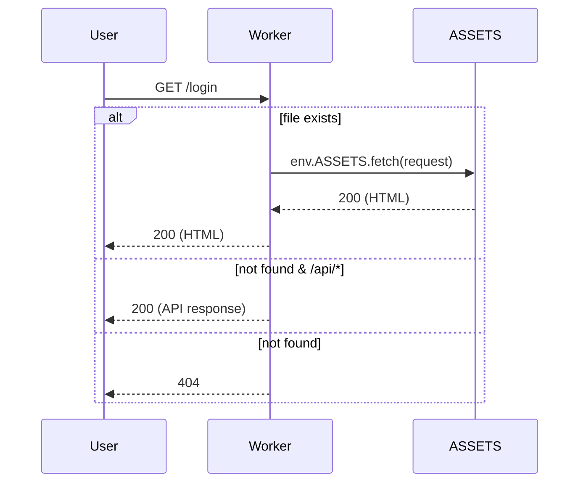

# Design

## Context & Components
- Hugo 负责生成静态站点至 `public/`
- Cloudflare Workers 以 `assets.directory=./public/` 提供静态资源
- 可选：通过 Worker 代码拦截动态路由或自定义缓存头

## Sequence (Mermaid)

## Constraints & Observability
- Static Assets 目录指向 `./public/`（Hugo 输出）
- 可启用 `run_worker_first` 以便先执行 Worker 逻辑再回落到 ASSETS（用于统一缓存策略或 API 前置检查）
- 日志包含必要字段（reason、userHash、maskedIp）

## Risks
- 错误码映射不一致 → 统一映射层并加强测试
- 过度开启 run_worker_first 影响纯静态资源延迟 → 仅对需要的路由开启

## Rollback
- 通过 `wrangler versions` 或回滚至上一次已知版本；静态资源回滚即回退构建产物

## Alternatives
- 不启用 Worker 代码，仅使用 assets-first 模式（延迟最低，灵活性较弱）