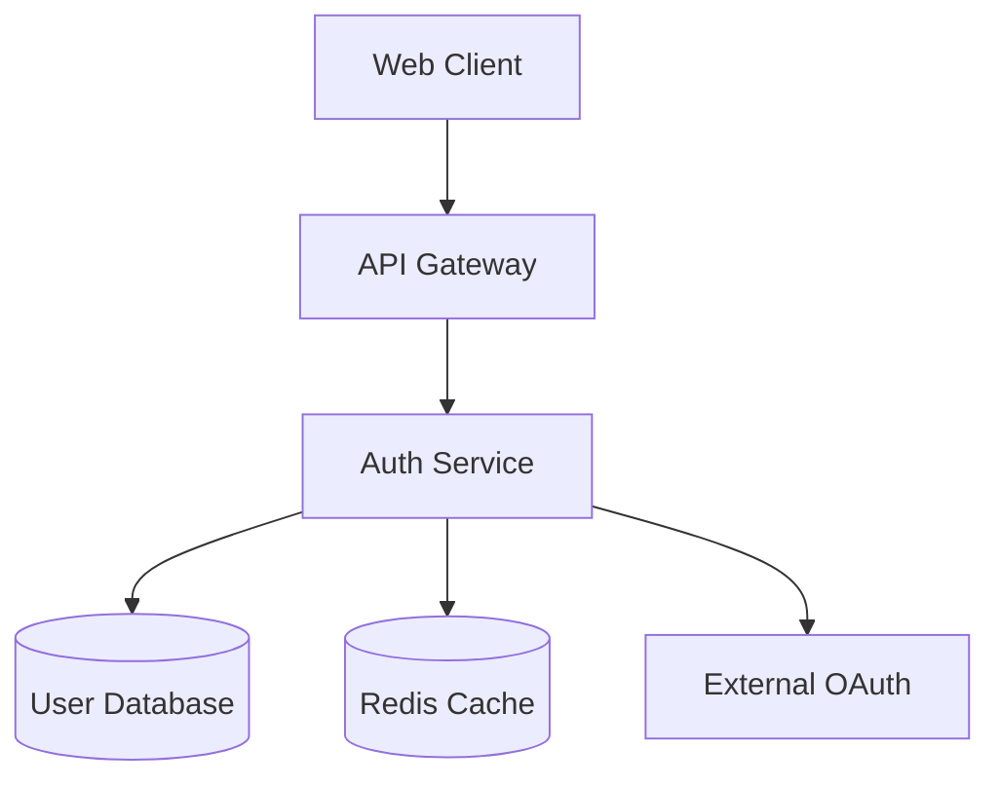

# Documentation Guide

Comprehensive documentation standards managed by `@documentation-curator` to ensure living, accurate, and discoverable knowledge.

## 🎯 Documentation Philosophy

### Living Documentation
- **Always current** - Documentation reflects actual system state
- **Automatically updated** - Generated from code and maintained by agents
- **Version controlled** - Changes tracked alongside code
- **User-focused** - Written for specific audiences and use cases

### Information Architecture
- **Layered approach** - Overview → Details → Implementation
- **Cross-referenced** - Links between related concepts
- **Searchable** - Well-organized with clear taxonomy
- **Accessible** - Multiple formats for different needs

## 📚 Documentation Types

### 1. Architecture Documentation
**Owner**: `@design-architect`
**Location**: `specs/architecture/`

```markdown
# System Architecture - User Authentication Service

## Overview
The authentication service provides secure user identity management using JWT tokens with refresh token rotation.

## Architecture Diagram


## Components

### Authentication Service
- **Responsibility**: User login, token generation, session management
- **Technology**: Node.js, Express, JWT
- **Dependencies**: User Database, Redis Cache
- **Interfaces**: REST API, OAuth2 providers

### Token Management
- **Access Tokens**: Short-lived (15 minutes), JWT format
- **Refresh Tokens**: Long-lived (7 days), stored in secure HTTP-only cookies
- **Rotation Strategy**: New refresh token issued with each access token refresh

## Decision Records
- [ADR-001: JWT vs Session-based Authentication](adr/001-jwt-authentication.md)
- [ADR-002: Refresh Token Rotation Strategy](adr/002-refresh-token-rotation.md)

## Security Considerations
- Rate limiting on login attempts
- Password hashing using bcrypt (cost factor 12)
- CSRF protection for token refresh endpoints
- Secure cookie settings (HttpOnly, Secure, SameSite)
```

### 2. API Documentation
**Owner**: `@implementation-specialist`
**Location**: Generated from code annotations

```javascript
/**
 * @api {post} /api/auth/login User Login
 * @apiName UserLogin
 * @apiGroup Authentication
 * @apiVersion 1.0.0
 * 
 * @apiDescription Authenticate user and return access/refresh tokens
 * 
 * @apiParam {String} email User's email address
 * @apiParam {String} password User's password
 * 
 * @apiParamExample {json} Request Example:
 * {
 *   "email": "user@example.com",
 *   "password": "securePassword123"
 * }
 * 
 * @apiSuccess {String} accessToken JWT access token (15 min expiry)
 * @apiSuccess {Object} user User profile information
 * @apiSuccess {String} user.id User unique identifier
 * @apiSuccess {String} user.email User email address
 * @apiSuccess {String} user.name User display name
 * 
 * @apiSuccessExample {json} Success Response:
 * HTTP/1.1 200 OK
 * {
 *   "accessToken": "eyJhbGciOiJIUzI1NiIsInR5cCI6IkpXVCJ9...",
 *   "user": {
 *     "id": "user-123",
 *     "email": "user@example.com",
 *     "name": "John Doe"
 *   }
 * }
 * 
 * @apiError {String} error Error message
 * @apiError {Number} code Error code
 * 
 * @apiErrorExample {json} Invalid Credentials:
 * HTTP/1.1 401 Unauthorized
 * {
 *   "error": "Invalid email or password",
 *   "code": "INVALID_CREDENTIALS"
 * }
 * 
 * @apiErrorExample {json} Rate Limited:
 * HTTP/1.1 429 Too Many Requests
 * {
 *   "error": "Too many login attempts, please try again later",
 *   "code": "RATE_LIMITED",
 *   "retryAfter": 300
 * }
 */
async function login(req, res) {
    // Implementation...
}
```

### 3. User Guides
**Owner**: `@documentation-curator`
**Location**: `docs/guides/`

```markdown
# User Authentication Guide

## Getting Started

### Prerequisites
- Node.js 16+ installed
- Redis server running
- PostgreSQL database configured

### Quick Setup
```bash
# Clone and install
git clone <repository>
cd auth-service
npm install

# Configure environment
cp .env.example .env
# Edit .env with your database and Redis settings

# Run migrations
npm run migrate

# Start development server
npm run dev
```

### Basic Usage

#### 1. Register a New User
```javascript
const response = await fetch('/api/auth/register', {
    method: 'POST',
    headers: {
        'Content-Type': 'application/json'
    },
    body: JSON.stringify({
        email: 'user@example.com',
        password: 'securePassword123',
        name: 'John Doe'
    })
});

const { user, accessToken } = await response.json();
```

#### 2. Login Existing User
```javascript
const response = await fetch('/api/auth/login', {
    method: 'POST',
    headers: {
        'Content-Type': 'application/json'
    },
    body: JSON.stringify({
        email: 'user@example.com',
        password: 'securePassword123'
    })
});

const { user, accessToken } = await response.json();
```

#### 3. Use Protected Endpoints
```javascript
const response = await fetch('/api/user/profile', {
    headers: {
        'Authorization': `Bearer ${accessToken}`
    }
});

const userProfile = await response.json();
```

### Common Patterns

#### Token Refresh
```javascript
class AuthService {
    async refreshToken() {
        const response = await fetch('/api/auth/refresh', {
            method: 'POST',
            credentials: 'include' // Include refresh token cookie
        });
        
        if (response.ok) {
            const { accessToken } = await response.json();
            this.setAccessToken(accessToken);
            return accessToken;
        }
        
        // Refresh failed, redirect to login
        this.redirectToLogin();
    }
    
    async apiCall(url, options = {}) {
        let response = await fetch(url, {
            ...options,
            headers: {
                ...options.headers,
                'Authorization': `Bearer ${this.getAccessToken()}`
            }
        });
        
        // If token expired, try refresh
        if (response.status === 401) {
            const newToken = await this.refreshToken();
            if (newToken) {
                response = await fetch(url, {
                    ...options,
                    headers: {
                        ...options.headers,
                        'Authorization': `Bearer ${newToken}`
                    }
                });
            }
        }
        
        return response;
    }
}
```

### Troubleshooting

#### Common Issues

**"Invalid Credentials" Error**
- Verify email and password are correct
- Check if account is activated
- Ensure no extra whitespace in inputs

**"Rate Limited" Error**
- Too many failed login attempts
- Wait for the specified retry period
- Consider implementing exponential backoff

**Token Refresh Fails**
- Refresh token may be expired (7 days)
- Clear cookies and re-authenticate
- Check server logs for detailed error

#### Debug Mode
```bash
# Enable debug logging
DEBUG=auth:* npm run dev

# View authentication logs
tail -f logs/auth.log
```
```

### 4. Architecture Decision Records (ADRs)
**Owner**: `@design-architect`
**Location**: `specs/architecture/adr/`

```markdown
# ADR-001: JWT vs Session-based Authentication

## Status
Accepted

## Context
We need to choose an authentication mechanism for our distributed microservices architecture. The main options are:

1. **Session-based authentication** - Traditional server-side session storage
2. **JWT tokens** - Stateless token-based authentication

## Decision
We will use JWT (JSON Web Tokens) for authentication with the following implementation:

- Short-lived access tokens (15 minutes)
- Long-lived refresh tokens (7 days)
- Secure refresh token rotation
- Redis for token blacklisting

## Rationale

### Advantages of JWT
- **Stateless**: No server-side session storage required
- **Scalable**: Works well in distributed/microservices architecture
- **Cross-domain**: Can be used across different domains
- **Standard**: Well-established RFC 7519 standard
- **Flexible**: Can include custom claims and user information

### Disadvantages Considered
- **Token size**: JWTs are larger than session IDs
- **Token revocation**: Harder to revoke tokens immediately
- **Security concerns**: Tokens stored in client-side storage

### Mitigation Strategies
- Keep access tokens short-lived (15 minutes)
- Use refresh token rotation for enhanced security
- Implement token blacklisting with Redis
- Store refresh tokens in secure HTTP-only cookies
- Include minimal claims in access tokens

## Alternatives Considered

### Session-based Authentication
**Pros**: Easy to revoke, smaller identifier size, server controls session state
**Cons**: Requires shared session storage, not suitable for distributed systems, CORS complications

**Decision**: Rejected due to microservices architecture requirements

### OAuth2 with External Providers Only
**Pros**: Delegates authentication responsibility, reduced attack surface
**Cons**: Dependency on external services, limited control, user experience complications

**Decision**: Will be supported in addition to JWT, not as replacement

## Implementation Details

### Token Structure
```json
{
  "header": {
    "alg": "HS256",
    "typ": "JWT"
  },
  "payload": {
    "sub": "user-123",
    "email": "user@example.com",
    "role": "user",
    "iat": 1635724800,
    "exp": 1635725700
  }
}
```

### Security Measures
- HMAC SHA-256 signing with 256-bit secret
- Refresh token rotation on each use
- Token blacklisting for compromised tokens
- Rate limiting on authentication endpoints
- Secure cookie settings for refresh tokens

## Consequences

### Positive
- Enables horizontal scaling without session affinity
- Reduces database load (no session lookups)
- Simplifies load balancer configuration
- Enables stateless microservice communication
- Supports mobile and SPA applications well

### Negative
- Increased complexity in token management
- Requires careful handling of token storage on client
- Token revocation requires additional infrastructure (Redis)
- Larger network overhead compared to session IDs

## Compliance
This decision supports our requirements for:
- GDPR compliance (user data control and deletion)
- SOC 2 Type II (access control and monitoring)
- PCI DSS (if handling payment data)

## Monitoring
We will track:
- Token refresh rates
- Authentication failure rates
- Token blacklist hit rates
- Average token size and network impact

## Review Date
This decision will be reviewed in 12 months or if significant security concerns arise.

## References
- [RFC 7519: JSON Web Token (JWT)](https://tools.ietf.org/html/rfc7519)
- [OWASP JWT Security Best Practices](https://owasp.org/www-project-web-security-testing-guide/latest/4-Web_Application_Security_Testing/06-Session_Management_Testing/10-Testing_JSON_Web_Tokens)
- [Auth0 JWT Best Practices](https://auth0.com/blog/a-look-at-the-latest-draft-for-jwt-bcp/)
```

### 5. Runbooks
**Owner**: `@quality-guardian` + `@documentation-curator`
**Location**: `docs/runbooks/`

```markdown
# Authentication Service Runbook

## Service Overview
- **Service**: User Authentication Service
- **Team**: Platform Security
- **On-call**: #auth-oncall Slack channel
- **Dashboard**: https://dashboard.company.com/auth-service
- **Logs**: https://logs.company.com/auth-service

## Health Checks
- **Health Endpoint**: `GET /health`
- **Dependencies**: PostgreSQL, Redis, OAuth providers
- **SLI/SLO**: 99.9% uptime, <200ms p95 response time

## Common Issues

### High Login Failure Rate

**Symptoms**
- Increased 401 responses on `/api/auth/login`
- Alert: "Auth login failure rate >10%"
- User reports: "Cannot log in"

**Investigation**
```bash
# Check recent login attempts
kubectl logs -f deployment/auth-service | grep "login_attempt"

# Check database connectivity
kubectl exec -it deployment/auth-service -- npm run db:check

# Check Redis connectivity
kubectl exec -it deployment/auth-service -- npm run redis:check
```

**Resolution**
1. **Database Issues**: 
   - Check PostgreSQL connection pool
   - Verify database disk space
   - Check for long-running queries
   
2. **Rate Limiting Issues**:
   - Check Redis rate limiting counters
   - Consider temporary rate limit increase
   - Review for potential attack patterns

3. **External OAuth Issues**:
   - Check OAuth provider status pages
   - Verify OAuth configuration
   - Test OAuth endpoints manually

### Token Refresh Failures

**Symptoms**
- Increased 401 responses on protected endpoints
- Alert: "Token refresh failure rate >5%"
- Users forced to re-login frequently

**Investigation**
```bash
# Check refresh token errors
kubectl logs -f deployment/auth-service | grep "refresh_token_error"

# Check Redis token blacklist
kubectl exec -it deployment/redis -- redis-cli keys "blacklist:*" | wc -l

# Check token expiry patterns
kubectl logs -f deployment/auth-service | grep "token_expired" | tail -100
```

**Resolution**
1. **Expired Refresh Tokens**:
   - Check refresh token TTL configuration
   - Review user activity patterns
   - Consider adjusting token lifetimes

2. **Redis Issues**:
   - Check Redis memory usage
   - Verify Redis persistence settings
   - Check for Redis failovers

### Performance Degradation

**Symptoms**
- Response times >500ms p95
- Alert: "Auth service slow response"
- Increased timeout errors

**Investigation**
```bash
# Check response time metrics
curl -s https://dashboard.company.com/api/metrics/auth-service/response-times

# Check database query performance
kubectl exec -it deployment/postgres -- psql -c "
  SELECT query, mean_time, calls 
  FROM pg_stat_statements 
  ORDER BY mean_time DESC 
  LIMIT 10;"

# Check application metrics
kubectl top pods -l app=auth-service
```

**Resolution**
1. **Database Performance**:
   - Review slow query log
   - Check index usage
   - Consider query optimization

2. **Memory Issues**:
   - Check for memory leaks
   - Review garbage collection metrics
   - Consider scaling up pods

3. **High Load**:
   - Check concurrent user metrics
   - Consider horizontal scaling
   - Review rate limiting settings

## Deployment Procedures

### Rolling Update
```bash
# Update deployment
kubectl set image deployment/auth-service auth-service=auth-service:v2.1.0

# Monitor rollout
kubectl rollout status deployment/auth-service

# Verify health
curl -f https://auth-api.company.com/health
```

### Rollback
```bash
# Rollback to previous version
kubectl rollout undo deployment/auth-service

# Check rollback status
kubectl rollout status deployment/auth-service

# Verify functionality
npm run test:smoke
```

### Database Migrations
```bash
# Backup database
kubectl exec -it deployment/postgres -- pg_dump auth_db > backup.sql

# Run migrations
kubectl exec -it deployment/auth-service -- npm run migrate

# Verify migration
kubectl exec -it deployment/auth-service -- npm run migrate:status
```

## Security Procedures

### Suspected Token Compromise
1. **Immediate Actions**:
   ```bash
   # Add tokens to blacklist
   kubectl exec -it deployment/redis -- redis-cli set "blacklist:${TOKEN_JTI}" "1" EX 86400
   
   # Force user re-authentication
   kubectl exec -it deployment/redis -- redis-cli del "refresh:${USER_ID}"
   ```

2. **Investigation**:
   - Review access logs for suspicious patterns
   - Check token usage from unusual locations
   - Coordinate with security team

3. **Communication**:
   - Notify affected users via email
   - Update security incident log
   - Post-incident review

### Password Breach Response
1. **Force password reset** for affected users
2. **Invalidate all tokens** for affected accounts
3. **Enable additional monitoring** for suspicious activity
4. **Update security policies** if needed

## Monitoring & Alerts

### Key Metrics
- **Login success rate**: >95%
- **Token refresh success rate**: >98%
- **Response time p95**: <200ms
- **Error rate**: <1%
- **Concurrent users**: Baseline tracking

### Alert Thresholds
- **Critical**: Login success rate <90% for 5 minutes
- **Warning**: Response time p95 >500ms for 10 minutes
- **Info**: New user registrations >1000/hour

### Dashboards
- **Overview**: Service health, key metrics, error rates
- **Performance**: Response times, throughput, resource usage
- **Security**: Login patterns, failed attempts, token metrics

## Emergency Contacts
- **Primary On-call**: Check PagerDuty rotation
- **Backup**: Check Slack #auth-oncall
- **Security Team**: security@company.com
- **Platform Team**: platform@company.com

## Related Documentation
- [Authentication API Documentation](../api/auth.md)
- [Security Architecture](../architecture/security-model.md)
- [Incident Response Playbook](../security/incident-response.md)
```

## 📋 Documentation Standards

### Writing Guidelines

#### Structure Templates
```markdown
# [Document Title]

## Overview
Brief description of what this document covers and who should read it.

## Prerequisites
What readers need to know or have set up before using this document.

## Main Content
Organized in logical sections with:
- Clear headings (H2, H3 levels)
- Code examples with syntax highlighting
- Screenshots where helpful
- Links to related documentation

## Examples
Working examples that readers can copy and use.

## Troubleshooting
Common issues and their solutions.

## References
Links to related documentation, external resources, RFCs, etc.

---
*Last updated: [Date] by [Agent/Person]*
*Next review: [Date]*
```

#### Code Documentation
```javascript
/**
 * Service class for user authentication operations
 * 
 * Handles user login, registration, token management, and session control.
 * Integrates with PostgreSQL for user storage and Redis for session caching.
 * 
 * @example
 * ```javascript
 * const authService = new AuthService({
 *   database: postgresConnection,
 *   cache: redisConnection
 * });
 * 
 * const user = await authService.login('user@example.com', 'password');
 * ```
 * 
 * @since 1.0.0
 */
class AuthService {
    /**
     * Authenticate user with email and password
     * 
     * @param {string} email - User's email address
     * @param {string} password - User's plain text password
     * @returns {Promise<AuthResult>} User object with tokens
     * 
     * @throws {InvalidCredentialsError} When email/password combination is invalid
     * @throws {RateLimitError} When too many login attempts detected
     * @throws {DatabaseError} When database operation fails
     * 
     * @example
     * ```javascript
     * try {
     *   const result = await authService.login('user@example.com', 'password123');
     *   console.log('Login successful:', result.user.name);
     * } catch (error) {
     *   if (error instanceof InvalidCredentialsError) {
     *     console.log('Invalid login credentials');
     *   }
     * }
     * ```
     */
    async login(email, password) {
        // Implementation...
    }
}
```

### Quality Checklist

#### Before Publishing
- [ ] **Accuracy**: All information is correct and current
- [ ] **Completeness**: Covers all necessary topics for target audience
- [ ] **Clarity**: Language is clear and appropriate for readers
- [ ] **Examples**: Include working, tested examples
- [ ] **Links**: All internal and external links work
- [ ] **Formatting**: Proper markdown, syntax highlighting, structure
- [ ] **Review**: Technical accuracy verified by domain expert

#### Maintenance Schedule
- **Weekly**: Check and update API documentation
- **Monthly**: Review user guides for accuracy
- **Quarterly**: Full audit of architecture documentation
- **Yearly**: Major revision of standards and guidelines

## 🔧 Documentation Tools

### Generation Tools
```javascript
// API documentation generation
{
  "scripts": {
    "docs:api": "apidoc -i src/ -o docs/api/",
    "docs:code": "jsdoc -c jsdoc.json",
    "docs:architecture": "mermaid-cli -i diagrams/ -o docs/diagrams/",
    "docs:build": "npm run docs:api && npm run docs:code && npm run docs:architecture"
  }
}
```

### Validation Tools
```bash
# Markdown linting
markdownlint docs/**/*.md

# Link checking
markdown-link-check docs/**/*.md

# Spelling check
cspell "docs/**/*.md"

# Documentation coverage
documentation-coverage src/
```

### Automation
```yaml
# .github/workflows/docs.yml
name: Documentation

on:
  push:
    branches: [main]
    paths: ['src/**', 'docs/**']

jobs:
  update-docs:
    runs-on: ubuntu-latest
    steps:
      - uses: actions/checkout@v2
      - uses: actions/setup-node@v2
      - run: npm ci
      - run: npm run docs:build
      - run: npm run docs:validate
      - uses: peaceiris/actions-gh-pages@v3
        with:
          github_token: ${{ secrets.GITHUB_TOKEN }}
          publish_dir: ./docs
```

## 📊 Documentation Metrics

### Quality Metrics
- **Completeness**: % of APIs documented
- **Freshness**: Average age of documentation
- **Usage**: Page views and user engagement
- **Feedback**: User ratings and comments

### Tracking
```javascript
// Documentation analytics
class DocumentationAnalytics {
    trackPageView(page, user) {
        this.metrics.increment('docs.page_views', {
            page,
            user_type: user.role
        });
    }
    
    trackSearchQuery(query, results) {
        this.metrics.increment('docs.searches', {
            query,
            result_count: results.length
        });
    }
    
    trackFeedback(page, rating, comment) {
        this.metrics.gauge('docs.rating', rating, { page });
        if (comment) {
            this.metrics.increment('docs.feedback_comments', { page });
        }
    }
}
```

---

**Remember**: Documentation is maintained by `@documentation-curator` and should always reflect the current system state. Great documentation enables great software! 📚